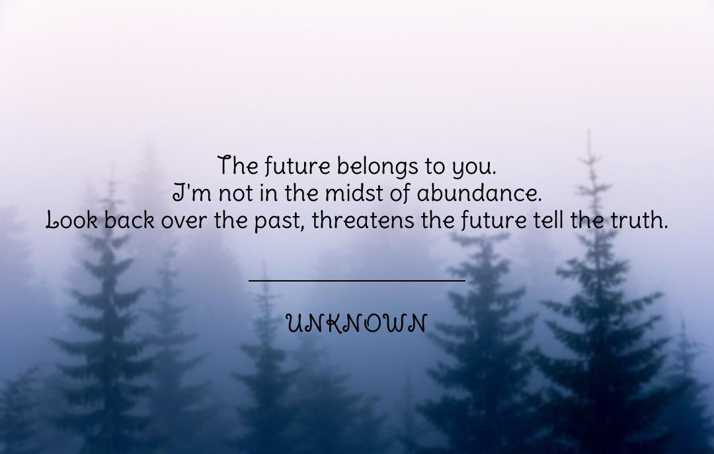

# Unknown: Quote Generation with Markov Chains

Unknown creates an image containing a random quote generated with Markov chains using the [Markovify](https://github.com/jsvine/markovify) Python library.
The quote is generated based on large corpora of famous quotes, and the background image is pulled randomly from Unsplash using their API.
I worked on this project because I enjoy reading thought-provoking quotes. The quotes generated by this *unknown* author are fascinating, and I was taken off guard by some of the quotes it created.

## Run Locally

To run this project locally, you need to have `Python` version 3.8 or 3.9 and [Poetry](https://python-poetry.org/docs/#installation) installed on your machine. 

Clone the project

```bash
  git clone https://github.com/Ochirsaikhan/Unknown.git
```

Go to the project directory

```bash
  cd Unknown
```

Install dependencies

```bash
  poetry install
```


## Environment Variables

To run this project, you will need to add the Unsplash API key to your environment.
To get the Unsplash API access key, go to this [link](https://unsplash.com/developers), and register as a developer.

```bash
  export UNSPLASH_API_KEY="your_key"
```

```bash
  cd src
```

Run the program

```bash
  poetry run python main.py
```

## Examples

After running the program, you should have an image created in the "output" directory called `quote.jpg`.




## Lessons Learned

As this was the first personal project I've worked on, I learned a lot when completing this project, from understanding what an API is and how to use them to reading documentation and figuring out how to implement features I want using an external library. But, most importantly, I learned that working on a challenging project that interests me can be an enjoyable experience, and I liked what I was able to build in the end.

## Authors

- [@Ochirsaikhan](https://www.github.com/Ochirsaikhan)